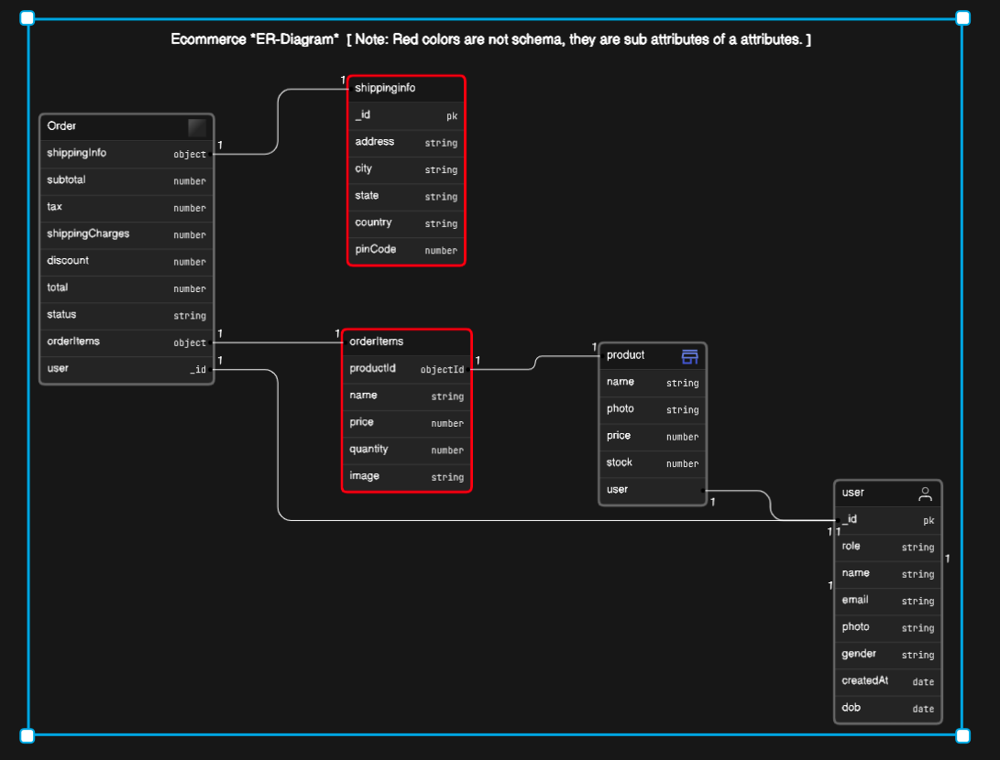

## Main Objective is to practice and understand E-commerce backend with Model and schema using mongoose , mongodb , express and NODE.

### Will try to complete the backend part as soon as possible , later will focus on frontend.

- Rethinking about the project: will learn basics of **typescript** and do this project with typescript. No need to do the same thing again and again.
- this model might be changed

### [Model](https://app.eraser.io/workspace/bUnME8XNEGJo5cBcOAyi):

